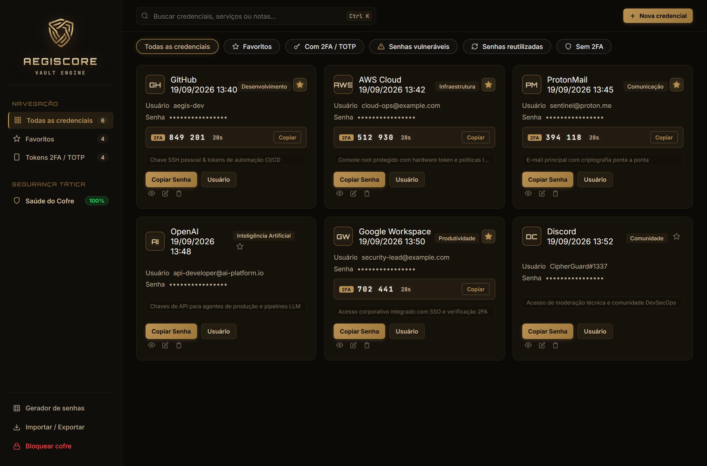
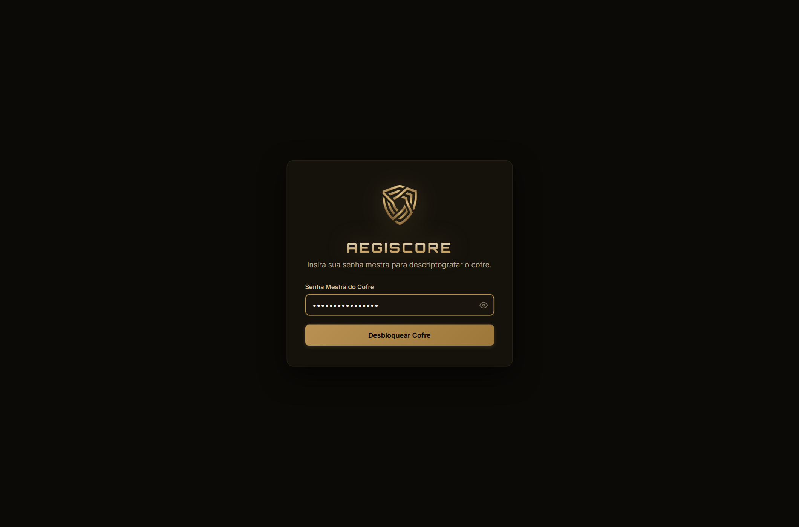
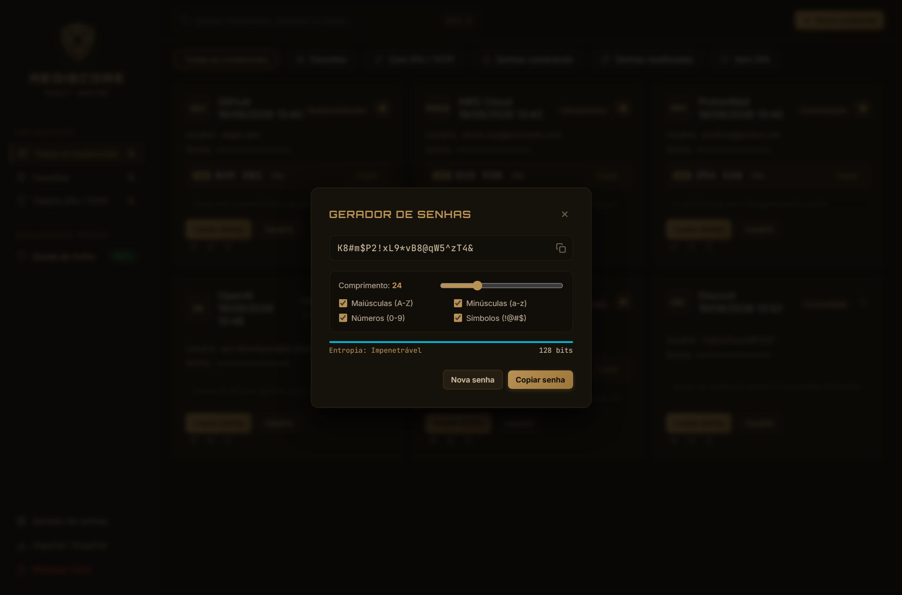
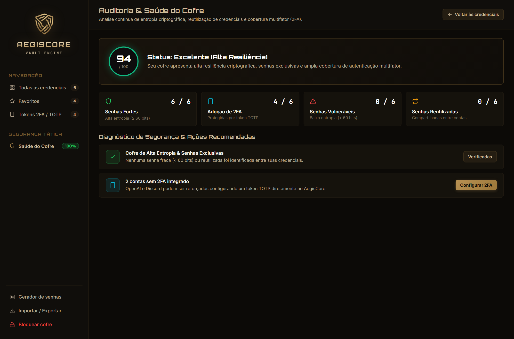

<div align="center">

# 🛡️ AegisCore — Vault Engine

**[ 🇺🇸 English ](README.md)** • **[ 🇧🇷 Português (Brasil) ](README.pt-BR.md)**

[](./LICENSE)
[](https://www.python.org/)
[](https://www.microsoft.com/windows)
[](#-arquitetura-criptográfica--segurança)
[](https://github.com/MatheusgVentura/AegisCore)

<p align="center">
  <strong>Cofre de senhas local, auditável e impenetrável com tema Bronze Imperial Tático e criptografia militar de ponta a ponta.</strong>
</p>

<p align="center">
  
</p>

</div>

---

## 📖 Visão Geral

O **AegisCore** é um gerenciador de senhas e credenciais local, independente e de código aberto (*Open Source*). Projetado sob o lema **Privacidade Absoluta e Zero Telemetria**, seus dados jamais saem do seu computador. Não há servidores externos, rastreadores ou nuvens de terceiros envolvidas.

Com uma interface moderna inspirada na elegância do tema *Bronze Imperial Tático* e no escudo geométrico (*Aegis*), o AegisCore une arquitetura criptográfica de padrão militar à usabilidade fluida de um aplicativo desktop nativo.

---

## 📸 Demonstração Visual

<div align="center">

| Tela de Desbloqueio (Master Key) | Gerador com Entropia em Tempo Real |
| :---: | :---: |
|  |  |
| *Cofre trancado por derivação de chave Argon2id* | *Geração CSPRNG com medição de bits de entropia* |

| Dashboard de Auditoria & Saúde do Cofre (v1.1.0) |
| :---: |
|  |
| *Monitoramento contínuo de entropia criptográfica, detecção de reuso de senhas e análise de cobertura 2FA* |

</div>

---

## 🔒 Arquitetura Criptográfica & Segurança

A segurança do AegisCore segue rigorosamente o **Princípio de Kerckhoffs**: a segurança reside inteiramente na força da chave matemática e da sua senha mestra, e não em esconder o código-fonte.

- **Derivação de Chaves (KDF):** Utiliza `Argon2id` (vencedor da *Password Hashing Competition*) com **64 MB** de memória RAM dedicada, 4 iterações e 4 pistas paralelas (`lanes`), além de Salt criptográfico exclusivo de 16 bytes (`os.urandom(16)`). Isso inviabiliza tentativas de quebra por força bruta usando clusters de GPU ou ASICs.
- **Cifra Autenticada (AEAD):** Criptografia simétrica `AES-256-GCM` com verificação de integridade via Tag de 128 bits e Nonce aleatório de 96 bits a cada gravação. Se um único bit do cofre for modificado indevidamente, o cofre recusa a abertura.
- **Persistência Atômica com `os.fsync()`:** Todas as gravações no disco são feitas primeiro em um arquivo temporário com flush forçado no hardware do disco antes da substituição atômica, eliminando o risco de arquivos corrompidos em quedas repentinas de energia.
- **Backup Automático (`vault.enc.bak`):** Um backup prévio do estado anterior do cofre é preservado automaticamente a cada modificação.
- **Higienização de Memória e Clipboard:** Limpeza automática da área de transferência após 15 segundos ao copiar senhas, prevenindo que outros programas capturem seus dados copiados.

---

## ✨ Funcionalidades

- **Autenticador 2FA / TOTP Integrado:** Gera tokens temporários de 6 dígitos (RFC 6238) com contador regressivo de 30s e cópia em 1 clique direto no cartão.
- **Auditoria de Segurança & Saúde do Cofre:** Dashboard analítico que calcula a resiliência do cofre (0 a 100%), identificando senhas de baixa entropia, credenciais reutilizadas e cobertura de autenticação multifator (2FA) com ações corretivas diretas.
- **Importação e Exportação Descomplicada (CSV):** Migre em segundos suas credenciais de navegadores (Chrome, Edge, Brave) ou outros gerenciadores (Bitwarden, KeePassXC) com detecção automática de colunas.
- **Reconhecimento Automático de Logos:** Detecção visual inteligente de centenas de serviços (GitHub, AWS, Google, ProtonMail, OpenAI, Discord, Steam, Microsoft, bancos brasileiros, etc.).
- **Acesso Rápido ao Navegador (↗️):** Botão direto no card para abrir o serviço ou página de login com segurança no navegador padrão do sistema.
- **Organização por Drag-and-Drop:** Reordene seus cartões arrastando e soltando livremente, com persistência criptografada.
- **Favoritos com 1 Clique:** Marque suas contas prioritárias para filtragem rápida.
- **Busca Instantânea (`Ctrl + K`):** Localize qualquer serviço, usuário ou nota instantaneamente pelo teclado.
- **Gerador Avançado de Senhas:** Escolha comprimento e pools de caracteres com cálculo dinâmico da entropia de Shannon (em bits e classificação).
- **Sem Telemetria:** Zero rastreamento, zero conexões de dados para a internet.

---

## 🚀 Como Usar e Instalar

### 🌟 Para Usuários Finais (Sem precisar ter Python instalado)
1. Acesse a aba [**Releases**](https://github.com/MatheusgVentura/AegisCore/releases) do repositório.
2. Baixe o pacote portátil **`AegisCore-Portable-Windows.zip`**.
3. Extraia o arquivo `.zip` em qualquer pasta e dê dois cliques em **`AegisCore.exe`**.

### 💻 Para Desenvolvedores (Rodando do código-fonte)

#### 1. Clonar o repositório
```bash
git clone https://github.com/MatheusgVentura/AegisCore.git
cd AegisCore
```

#### 2. Instalar dependências
```bash
pip install -r requirements.txt
```

#### 3. Executar em modo de desenvolvimento
```bash
python app.py
```
*(Ou em segundo plano sem janela de console: `pythonw app.py` ou duplo clique em `iniciar_aegiscore.bat`)*

#### 4. Compilar o executável portátil localmente
```powershell
.\build.bat
```
Os arquivos autônomos serão gerados na pasta `dist/`.

---

## 📁 Estrutura do Repositório

```text
📁 AegisCore/
│
├── 📄 app.py                  # Ponto de entrada do aplicativo (PyWebview + API Bridge)
├── 📄 vault_core.py            # Motor criptográfico (Argon2id, AES-GCM e I/O atômico)
├── 📄 build.bat               # Script de compilação automática para Windows
├── 📄 installer.iss           # Script de instalador executável (Inno Setup)
├── 📄 iniciar_aegiscore.bat   # Inicializador silencioso via Python
├── 📄 requirements.txt        # Dependências do ecossistema Python
├── 📄 LICENSE                 # Licença de código aberto MIT
├── 📄 aegiscore.ico           # Ícone oficial em alta resolução
├── 📄 README.md               # Documentação em Inglês
├── 📄 README.pt-BR.md         # Documentação em Português do Brasil
│
├── 📁 ui/                     # Interface Web HUD nativa
│   ├── 📄 index.html          # Marcação semântica e modais
│   ├── 📄 style.css           # Design Bronze Imperial & tipografia Orbitron / Michroma
│   ├── 📄 app.js              # Lógica de interface, drag-and-drop e bridges
│   └── 📄 logo.png            # Brasão em bronze imperial do escudo AegisCore
│
└── 📁 docs/screenshots/       # Capturas de tela para demonstração
```

---

## ⚖️ Licença & Transparência

Este projeto é software livre e de código aberto disponibilizado sob a licença [MIT](./LICENSE). 

Acreditamos que todo software de segurança deve ser público e auditável. Pesquisadores de segurança e desenvolvedores são bem-vindos para inspecionar, auditar, abrir *issues* ou sugerir melhorias.

Copyright (c) 2026 Matheus Ventura.
